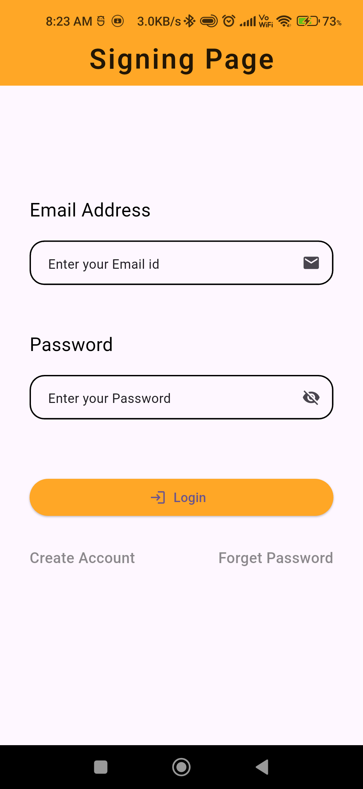
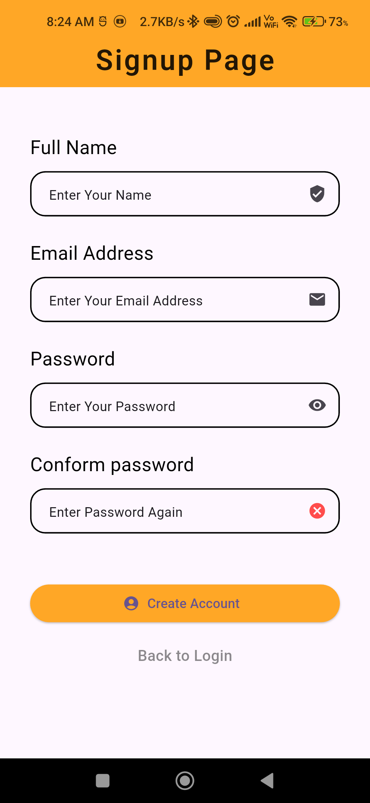
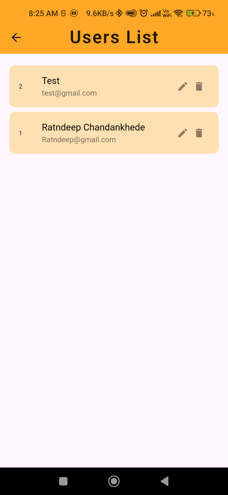
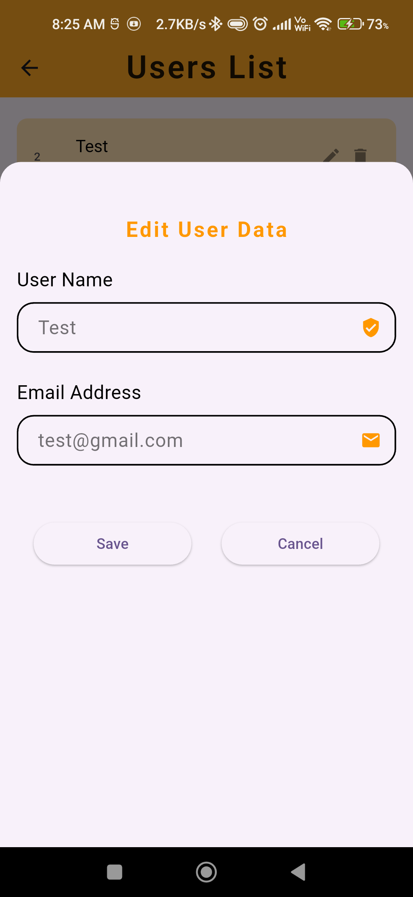
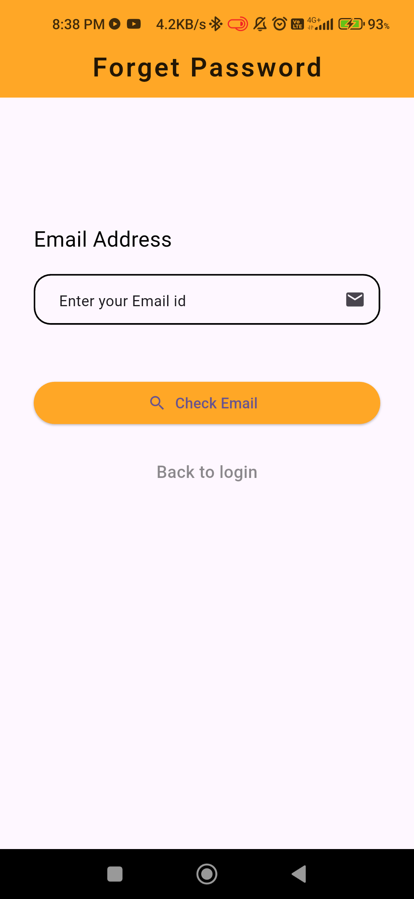
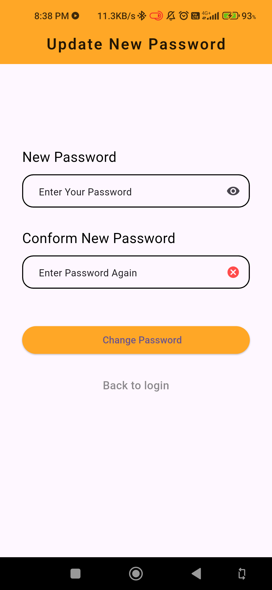

# User Authentication App – Flutter (SQLite + SharedPreferences)
A Flutter application that implements a complete and secure user authentication system using SQLite (Sqflite) for data storage and SharedPreferences for session management.
This project focuses on building a real-world authentication flow without using any backend, helping to understand how local databases and persistent sessions work in Flutter.

# Project Overview
**The app allows users to**
Register with email and password
Log in securely
Maintain login state using SharedPreferences
Recover forgotten passwords
Update their password after verification
View all registered users on the dashboard
All user data is stored locally using Sqflite, and the login session is managed using SharedPreferences.

**App Screens / Pages**

🔹 Splash Screen :
Checks login status using SharedPreferences and
Redirects user to Login or Dashboard

🔹 Sign In Page :
User login with email & password and
Credential verification from SQLite

🔹 Sign Up Page :
New user registration and
Stores user details securely in SQLite

🔹 Dashboard Page :
Displays list of all registered users,
Confirms successful authentication and
Logout functionality

🔹 Forget Password Page :
Verifies user email before password reset and

🔹 Update Password Page :
Allows user to set a new password and
Updates password in SQLite database

# Key Features
**Proper user authentication flow,**
**Local database using Sqflite,**
**Persistent login session using SharedPreferences and**
**Auto-login & logout handling.**

# Secure password update flow
**Dashboard showing registered users,**
**Clean and user-friendly UI,**
**Technologies & Packages Used,**
**Flutter & Dart,**
**Sqflite (Local Database) and**
**SharedPreferences (Session Management).**

# Learning Outcome
**This project helped me understand :**
**Real-world authentication logic,**
**Using SQLite for structured local data,**
**Managing user sessions in Flutter,**
**Combining database + preferences and**
**App flow handling using splash screen.**

# Feedback
**This project is part of my Flutter learning journey.**
**Feedback, suggestions, and improvements are always welcome**

# App Pages

Signing Page

Signup Page

Dashboard Page

Edit User Data

Forget Password Page

Update Password Page

